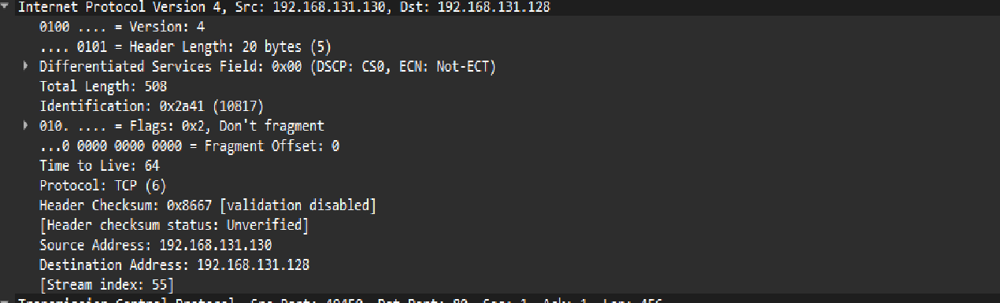
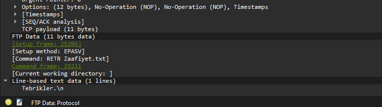
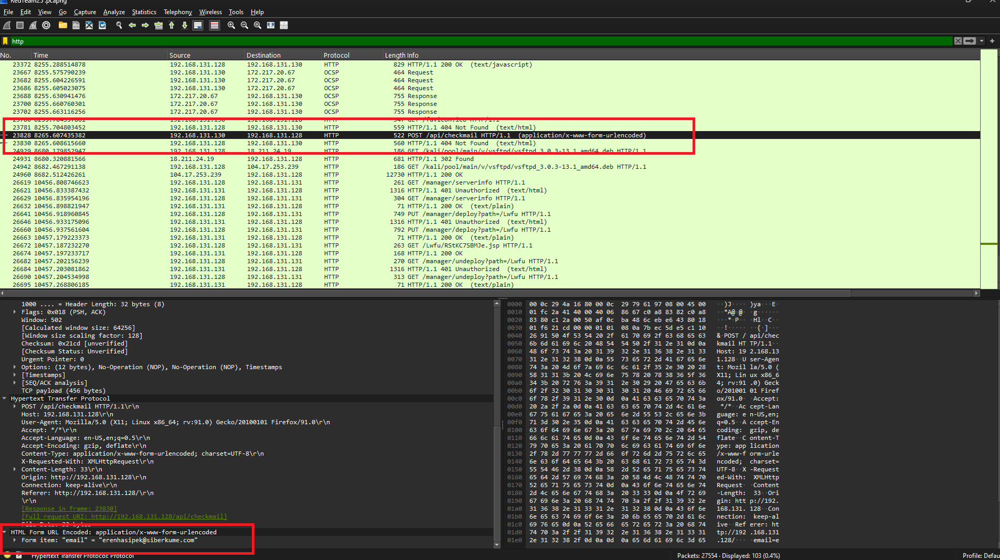
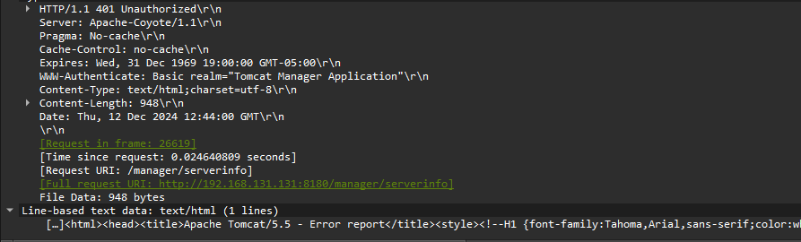

# Proje Hakkında
Bu proje, TSGK'nın (Türkiye Siber Güvenlik Kümelenmesi) uygulamalı pentest eğitimi için ön eleme sınavı kapsamında yaptığımız PCAP analizindeki kaynakları kullanarak yaptığım bir belgedir. Incident analysis yaptığımız bu çalışmadaki kaynakları PCAP dosyasında bulabilirsiniz.

# Senaryo
Web server çalıştıran bir makinamız var. Localde web server ile etkileşime geçen bir saldırgan makinamız var. Saldırgan makina, sunucu üzerinde belirli dosyalara erişim sağlıyor ve erişim sağlamaması gereken bir serviste yetki kazanıyor.

# Sorular ve Analizler

Sorulara ve cevaplara geçmeden önce saldırganla alakalı bilgi toplamak adına, hedef saldırının da web sunucusuna yapıldığını bildiğim için Wireshark üzerinde HTTP isteklerine göre filtreleyerek elde edilmiş dosyalara bakıyorum.

- HTTP paketlerine baktığımda sunucunun 192.168.131.128 IP adresinden cevap verdiğini görebiliyorum, ayrıca sunucuyla etkileşime geçen IP adresini de 192.168.131.130 olarak görüyorum.
- 24942 numaralı pakette FTP sunucusuna (vsFTP) bir istek yapıldığını ve sonrasında başarılı olduğunu görüyorum.
- 7980 numaralı pakette Zaafiyet.txt isminde bir dosyaya erişildiğini görüyorum .
- 26619 numaralı pakette sunucu API'ı ile etkileşime geçildiğini ve başta başarısız, 2. denemede başarılı olduğunu görüyorum.
- 26641 numaralı pakette de yine sunucu API' ile etkileşime geçildiğini ve başta başarısızken 2. denemede başarılı olduğunu görüyorum.
- 26619 ve 26641 numaralı paketlerde Basic Authorization kullanılmış, credentials olarak 2 success cevabında da tomcat:tomcat olarak verilmiş 

Bunları not aldıktan sonra sorulara geçiyorum.

1- Saldırgan makinanın IP adresi nedir?

Cevap: 192.168.131.130

### Analiz:

Wireshark üzerinde HTTP paketlerine göre filtrelediğimde isteklerin 192.168.131.130 üzerinden server ile etkileşime geçildiğini görüyorum. 

2- Hedef makinanın IP adresi nedir?

Cevap: 192.168.131.128

### Analiz:

Wireshark üzerinden HTTP paketlerine göre filtrelediğimde yapılan isteklerin 192.168.131.128 üzerinden cevap aldığını görüyorum.

3- Saldırgan makinanın MAC adresi nedir?

Cevap: 00:0c:29:79:61:97

### Analiz: 

Wireshark üzerinden ARP paketlerine göre filtrelediğimde 15484 numaralı pakette 192.168.131.130 makinanın 00:0c:29:79:61:97 adresinde olduğunu görüyorum.

4- Hedef makinanın MAC adresi nedir?

Cevap: 00:0c:29:4a:16:80

### Analiz

Wireshark üzerinde ARP paketlerine göre filtrelediğimde yine 15484 numaralı pakette 192.168.131.128 makinanın 00:0c:29:4a:16:80 adresinde olduğunu görüyorum.

5- "tsgk" kullanıcısının FTP parolası nedir?

Cevap: 123

### Analiz

Wireshark üzerinde FTP paketlerine göre filtrelediğimde direkt 25087 numaralı pakette "tsgk" kullanıcısının belirtildiğini, 25091 numaralı pakette şifreyi "123" olarak belirttiğini görüyorum.

6- Kaç kullanıcı FTP üzerinden oturum açmıştır?

Cevap: 1 tane başarılı bir şekilde oturum açmış, 1 tane kullanıcı başarısız olmuş.

### Analiz

Wireshark üzerinde FTP paketlerine göre filtrelediğimde direkt 25087 numaralı pakette kullanıcı adı "tsgk" olarak belirtilip şifre "123" olarak girilmiş. Daha aşağılarda ise "root" kullanıcısıyla yine "123" şifresi kullanılarak giriş yapılmaya çalışılmış fakat başarısız olmuş. Daha sonraki isteklerde ise yine "tsgk" kullanıcısına "123" şifresi verilerek giriş yapılmış.

7- Web servisinden indirilen dosyanın adı nedir?

Cevap: Zaafiyet.txt

### Analiz

Wireshark üzerinde HTTP isteklerine göre filtrelediğimde 7980 numaralı pakette Zaafiyet.txt dosyasına eriştiğini zaten fark etmiştim. Tekrardan FTP ile filtreleme yaptığımda 25144 numaralı pakette Zaafiyet.txt dosyasına eriştiğini görebiliyorum.

8- Web servisinden indirilen dosyanın içeriği nedir?

Cevap: "Tebrikler.\n"

### Analiz

Erişilen dosyanın adının Zaafiyet.txt dosyası olduğunu biliyorum, Wireshark üzerinde FTP-DATA olarak filtreleme yaptığımda 25213 numaralı pakette Zaafiyet.txt dosyasına erişildiğini ve "line-based text data" kısmında dosya içeriğini görebiliyorum.

8- Sunucudaki web server hangi portta çalışmaktadır?

Cevap: 80

### Analiz

HTTP Server olduğunu bildiğim için 80 portu olduğun tahmin ediyorum ama bakmakta fayda var. HTTP isteklerine göre filtrelediğimde herhangi bir 192.168.131.128 paketine girdiğimde transmission kısmında 80 portundan cevap verdiğini görüyorum.

9- Web servisi üzerinde çalışan uygulama içerisinde hangi e-posta adresi için sorgulama yapılmıştır? 

Cevap: erenhasipek@siberkume.com

### Analiz

Wireshark üzerinde HTTP isteklerine göre filtreleme yaptığımda 25828 numaralı pakette /api/checkmail adresine bir istek yapıldığını görüyorum. Parametreler kısmında e-posta adresine erişebiliyorum.

10- Saldırgan hangi uygulamanın zaafiyetli sürümünü kullanarak hedef makinaya erişim sağlamıştır?

Cevap: Analiz edebildiğim kadarıyla Tomcat 5.5 information disclosure tahmin ediyorum. (CVE-2010-1157)

### Analiz

Wireshark üzerinde HTTP olarak filtreleme yapınca bir 25828 numaralı paketteki API isteğine not found olarak cevap verdiğini gördüm, banner üzerinde versiyon bilgisi verebileceğini tahmin ettiğim için isteğe içeriğe girince sunucuda Apache 2.4.62 kullanıldığını gördüm.
Not Found olarak dönen cevaplara baktığımda bannerda Tomcat 5.5 olarak verildiğini gördüm. Tomcat 5.5.x olarak zaafiyet araştırması yaptığımda Information Disclosure zaafiyetinin olabileceğini fark ettim çünkü ilk yaptığım analizimde 2 request'in önce başarısız olup sonrasında basic auth ile tekrar denendiğinde başarılı olduğunu görmüştüm.

- [CVE](https://nvd.nist.gov/vuln/detail/cve-2010-1157)
- [ExploitDB](https://www.exploit-db.com/exploits/12343)
